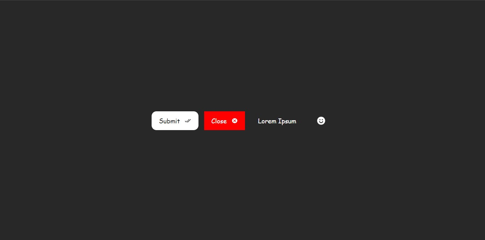

# **Simple Button Component**

A flexible and customizable button component built with HTML, CSS, and JavaScript. The button can have text, an icon, or both at the same time. Additionally, it supports event listeners and allows setting an ID for targeted CSS styling.



## Related Projects

[Simple Image Slider](https://github.com/S-Yaghouti/Slider)

## Features

- Text or Icon Support: Use the button with just text, just an icon, or both at the same time.
- Customizable with CSS: Assign a unique `id` to each button for targeted styling.
- Event Listeners: Easily attach JavaScript event listeners for user interaction.
- Lightweight: No external libraries or dependencies required.
- Cross-Browser Compatibility: Works on all modern browsers.

## Installation

### To integrate the button component into your project, follow these steps:

1. Download the Files: Clone or download the repository to your local machine.
2. **Serve the `index.html` File**: To view the slider in action, you’ll need to run a local server. Here are a few options:

   - **Using Live Server**: If you're using Visual Studio Code, you can install the [Live Server extension](https://marketplace.visualstudio.com/items?itemName=ritwickdey.LiveServer). Simply open the `index.html` file and click on "Open with Live Server."

   - **Using XAMPP**: Download and install [XAMPP](https://www.apachefriends.org/index.html). Move the project folder to the `htdocs` directory, then start the Apache server from the XAMPP Control Panel. Access the slider via `http://localhost/your-folder-name/index.html`.

   - **Using Python**: If you have Python installed, navigate to your project directory in the terminal or command prompt and run:
     ```bash
     python -m http.server
     ```
     This will start a simple HTTP server, which you can access at `http://localhost:8000/index.html`.

## Usage

### First you need to know what is button configuration parameters:

- ID: A unique identifier for the button.
- HaveText: Set to `true` to display text inside the button.
- Text: The text to be displayed on the button (if `HaveText` is `true`).
- HaveIcon: Set to `true` to display an icon inside the button.
- Icon: The icon to display (from the [Iconify](https://iconify.design/) library).
- HaveListener: Set to `true` to add an event listener to the button.
- Listener: The function to be executed when the button is clicked.

- BTN / BTN.js: A simple button for the image slider.
- Slider.js : exported slider widget and then imported in scipt.js file, You can imported in any js file you want.

### Now, let me explain how use BTN.js component:

1. Imported simple BTN.
```javascript
import { BTN } from "./BTN/BTN.js";
```

2. Call the BTN to append

```javascript

// Variables for Button Configuration
const SubmitID = "myButtonID"; // Unique ID for the button
const SubmitHaveText = true; // Set to true to display text
const SubmitButtonText = "Click Me"; // Text to display on the button
const SubmitHaveIcon = true; // Set to true to display an icon
const SubmitButtonIcon = "line-md:check-all"; // Icon from Iconify
const SubmitHaveListener = true; // Set to true to add a click listener

// Button Listener Function
function SubmitListener() {
  alert("Button clicked!"); // Action to perform on click
}

// Create Button
const SubmitButton = BTN(
  SubmitID, // Unique ID
  SubmitHaveText, // Display Text
  SubmitButtonText, // Button Text
  SubmitHaveIcon, // Display Icon
  SubmitButtonIcon, // Iconify Icon
  SubmitHaveListener, // Add Listener
  SubmitListener // Listener function
);

// Append Button to the DOM
document.body.appendChild(SubmitButton.widget);
```

## Credits & Contact

**Creator**: Subhaan Yaghouti - Maintainer of the project.

**Contact**: If you have any questions or feedback, feel free to reach out via [yaghouti.1831@gmail.com](mailto:yaghouti.1831@gmail.com) or on Instagram [@subhaan_yaghouti](https://www.instagram.com/subhaan_yaghouti?igsh=bmE3ZTl1bGkwaW50).
